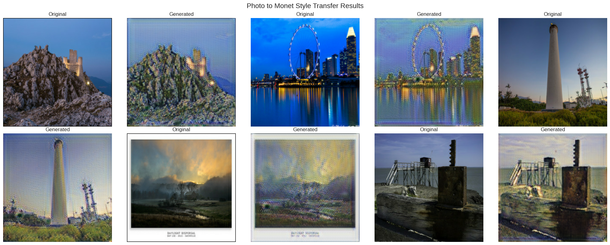
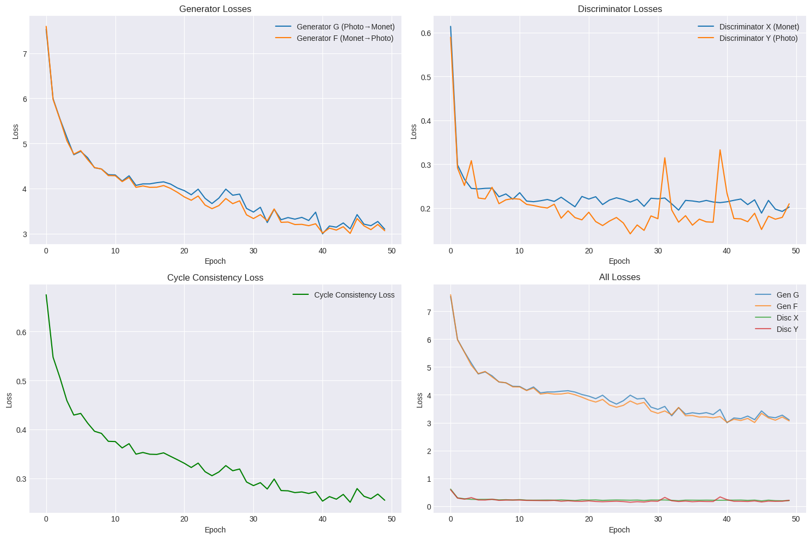
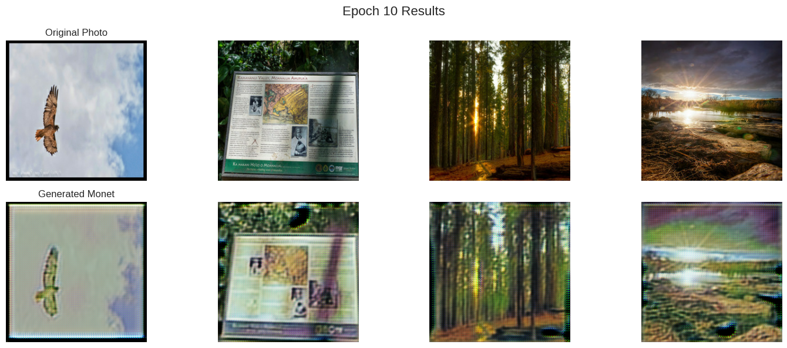
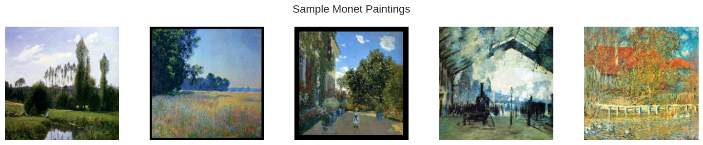

# Monet Style Transfer with CycleGAN

A CycleGAN, built in TensorFlow/Keras, that turns photographs into Monet-style paintings and scored a MiFID of 68.95 in Kaggle's [I'm Something of a Painter Myself](https://www.kaggle.com/competitions/gan-getting-started) competition.



*Each original photo is followed by its translation; pairs read left to right and wrap onto the second row.*

## Highlights

- **Kaggle score:** MiFID 68.95 on 10,000 generated paintings.
- **Unpaired translation:** learned Monet's style from 300 paintings and 7,038 photographs, with no matched photo–painting pairs.
- **Architecture:** two ResNet generators (9 residual blocks, 11.4 M parameters each) and two PatchGAN discriminators, with a custom instance-normalization layer.
- **Training:** 50 epochs of 100 steps at batch size 4, in 1 hour 45 minutes of training time on a single Tesla P100 GPU.

## Results

The trained photo-to-Monet generator keeps each photo's structure and adds brush-like texture, though digital artifacts remain visible, most clearly a fine grid-like pattern across each output. The image above shows sample translations by the final model.

The competition scores submissions with MiFID (Memorization-Informed Fréchet Inception Distance), which measures the quality and diversity of generated images and penalizes models that memorize training data. This model's 10,000-image submission scored **68.95**.

Training losses, averaged per epoch:



Generator loss fell from 7.53 in epoch 1 to 3.10 in epoch 50, and the discriminator losses settled around 0.2 with occasional spikes near 0.3.

Early samples from the training loop at epoch 10 of 50 (different photos from the figure above):



## Approach

CycleGAN learns two mappings between unpaired image domains: a generator G from photos to Monet paintings and a generator F from Monet paintings back to photos, each judged by its own discriminator. All four networks train together in one step.

**Generator (ResNet-based).** A 7×7 convolution with 64 filters, two stride-2 convolutions that downsample 256×256 inputs to 64×64×256 feature maps, nine residual blocks, two transposed-convolution blocks that upsample back to 256×256, and a final 7×7 convolution with a tanh output. Hidden convolutions use instance normalization, with ReLU activations.

**Discriminator (PatchGAN).** Four 4×4 convolutions with 64, 128, 256 and 512 filters and LeakyReLU (slope 0.2), followed by a 1-filter convolution. It outputs a 32×32 grid of real-or-fake scores, one per image patch, rather than a single score for the whole image.

**Losses.**

| Loss | Form | Weight |
|---|---|---|
| Adversarial | Least-squares (LSGAN) | 1 |
| Cycle consistency | L1 between an image and its round-trip reconstruction (photo → Monet → photo and back) | 10 |
| Identity | L1 between an image and the output of the generator that maps into its own domain | 0.5 |

**Training.** Adam (learning rate 2e-4, β₁ 0.5), batch size 4, 50 epochs of 100 steps, random seed 42. Augmentation applies a random horizontal flip and a random zoom of up to ±10%.

## Data

The competition provides 300 Monet paintings and 7,038 photographs, 256×256 RGB, as JPEG files and as TFRecords (5 Monet files and 20 photo files). The notebook trains on the TFRecords and generates the submission from the photo JPEGs.

A sample of the Monet paintings the generator learns from:



## Run it

**On Kaggle (recommended).** Open the [published notebook on Kaggle](https://www.kaggle.com/code/jonchernoch/style-transfer-with-cyclegan-68-9-mifid) and copy it, or create a notebook in the [competition](https://www.kaggle.com/competitions/gan-getting-started), import `gan-project.ipynb`, attach the competition data and select a GPU accelerator. The notebook reads its data from `/kaggle/input/gan-getting-started/` and writes its submission to `/kaggle/working/images.zip`.

**Locally.** Install the dependencies, download the competition data, and update the data paths in the notebook's `Config` class:

```bash
pip install -r requirements.txt
```

`requirements.txt` lists the packages unpinned, because the recorded run did not print their versions. That run used Kaggle's Python 3.11.11 GPU image (docker image version 31042); papermill timed the full notebook, including data loading and submission generation, at 6,651 seconds, about 1 hour 51 minutes.

## Repo layout

| Path | Contents |
|---|---|
| `gan-project.ipynb` | The full notebook: data loading, EDA, model, training, results and submission, with the outputs of the recorded run |
| `assets/` | Figures for this README, taken unchanged from the notebook's outputs |
| `requirements.txt` | Python packages the notebook imports |
| `LICENSE` | MIT License |
| `README.md` | This file |

## What I'd do next

- **Reduce the grid-like artifacts** visible in the generated images, and measure each change against the 68.95 baseline.
- **Train longer:** each epoch covers 400 images (100 steps at batch size 4), so the 50-epoch run saw about 20,000 photo samples.
- **Re-enable random-rotation augmentation**, which is commented out in the data pipeline.

## About

Built by Jonathan Chernoch for Intro to Deep Learning, taught by Professor Geena Kim, as an entry in Kaggle's "I'm Something of a Painter Myself" competition.

References:

1. Zhu, J. Y., Park, T., Isola, P., & Efros, A. A. (2017). Unpaired image-to-image translation using cycle-consistent adversarial networks. *Proceedings of the IEEE International Conference on Computer Vision*, 2223–2232.
2. Kaggle Competition: I'm Something of a Painter Myself. https://www.kaggle.com/competitions/gan-getting-started
3. TensorFlow CycleGAN Tutorial. https://www.tensorflow.org/tutorials/generative/cyclegan
4. Ulyanov, D., Vedaldi, A., & Lempitsky, V. (2016). Instance Normalization: The Missing Ingredient for Fast Stylization.

## License

Released under the MIT License; see [LICENSE](LICENSE).
